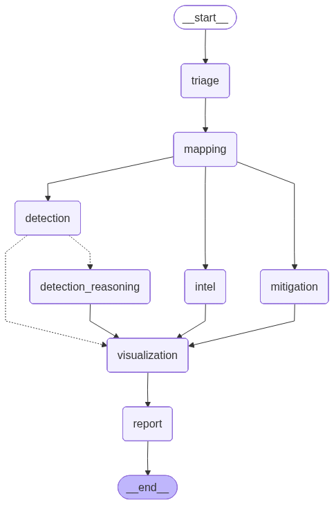
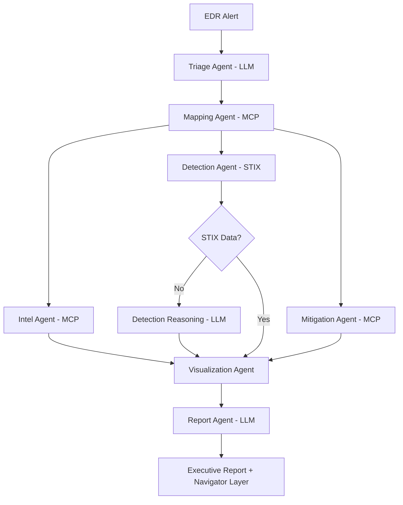

# 🛡️ MITRE Agentic Threat Investigation
### Enterprise-Grade AI-Powered Security Operations Center (SOC) Automation

<p align="center">
  
</p>

<p align="center">
  <a href="https://huggingface.co/spaces/Inoussa-guru/mitre-agentic-threat-investigation">
    
  </a>
  <a href="https://github.com/imouiche/mitre-agentic-langgraph-mcp/blob/main/LICENSE">
    
  </a>
  <a href="https://python.langchain.com/docs/langgraph">
    
  </a>
  
</p>

<p align="center">
  <b>Deterministic MITRE ATT&CK Intelligence + LLM Reasoning</b><br/>
  Production-ready architecture for SOC analysts, detection engineers, and security researchers
</p>

---

## 🎯 What Makes This Project Different?

Most "AI security" demos are just LLMs making up answers. **This system is different:**

| Traditional AI Security | MITRE Agentic Investigation |
|------------------------|----------------------------|
| ❌ LLM generates everything | ✅ **MITRE ATT&CK is ground truth** |
| ❌ No source validation | ✅ **Every technique verified via MCP** |
| ❌ Hallucination-prone | ✅ **Conditional logic prevents errors** |
| ❌ Black box reasoning | ✅ **Transparent 8-agent workflow** |
| ❌ No enterprise integration | ✅ **Production-ready architecture** |

> **This is how enterprise SOC automation should be built.**

---

## 🚀 Key Capabilities

Transform raw security alerts into actionable intelligence in **< 2 minutes**:

### 📥 **Input**
```
EDR Alert: WINWORD.EXE spawned powershell.exe with encoded command.
Scheduled task created. External IP connection detected.
```

### 📊 **Output**
- ✅ **4 MITRE-validated techniques** (T1059.001, T1053.005, T1071.001, T1204.002)
- ✅ **Threat actor attribution** (APT29, Lazarus Group, FIN7)
- ✅ **Detection engineering rules** (STIX data components + custom logic)
- ✅ **Defensive mitigations** (M1038: Execution Prevention, M1026: Privileged Account Management)
- ✅ **ATT&CK Navigator heatmap** (Visual threat landscape)
- ✅ **Executive incident report** (CISO-ready markdown)

---

## 🏗️ Architecture Highlights

### **Multi-Agent Orchestration (LangGraph)**

<p align="center">
  
</p>


### **Why LangGraph?**

- ✅ **Conditional routing** - Detection reasoning only when needed
- ✅ **Parallel execution** - Intel, Detection, Mitigation run concurrently
- ✅ **State management** - Explicit data contracts between agents
- ✅ **Fault tolerance** - Retry logic with exponential backoff
- ✅ **Observable** - Every agent transition is logged

---

## 🔌 MITRE MCP Integration Deep Dive

### **What is MCP (Model Context Protocol)?**

MCP is Anthropic's standard for connecting LLMs to external tools. This project demonstrates **enterprise-grade MCP usage** with the official MITRE ATT&CK server.

### **Agent → MCP Tool Mapping**

| Agent | Purpose | MCP Tools | Fallback |
|-------|---------|-----------|----------|
| 🔍 **Triage** | Extract technique candidates | None (pure LLM) | N/A |
| 🗺️ **Mapping** | Validate techniques | `get_technique_by_id`<br/>`get_technique_tactics` | Retry 3x |
| 🕵️ **Intel** | Threat attribution | `get_groups_using_technique`<br/>`get_software_using_technique` | Empty list |
| 🔬 **Detection** | STIX telemetry | `get_datacomponents_detecting_technique` | LLM reasoning |
| 🧠 **Reasoning** | Detection gaps | None (pure LLM) | N/A |
| 🛡️ **Mitigation** | Defensive controls | `get_mitigations_mitigating_technique` | Empty list |
| 🎨 **Visualization** | ATT&CK layer | `generate_layer` | Text output |
| 📄 **Report** | Executive summary | None (aggregator) | N/A |

---

## 💡 Real-World Use Cases

### **1. Incident Response Automation**
> "Reduce alert triage time from 30 minutes to 90 seconds"

**Before:** Analyst manually searches MITRE, cross-references IOCs, writes report  
**After:** Paste alert → Get validated techniques + detection rules + report

### **2. Threat Hunt Planning**
> "Generate ATT&CK Navigator layers for proactive hunting"

**Use Case:** Security team needs to prioritize detections for ransomware TTPs  
**Solution:** Run investigation on ransomware IOCs → Get prioritized technique heatmap

### **3. Detection Engineering Validation**
> "Verify SIEM rules map to correct MITRE techniques"

**Before:** Manual MITRE.org searches, inconsistent tagging  
**After:** Automated technique validation with STIX data component mapping

### **4. Executive Reporting**
> "Auto-generate board-ready incident summaries"

**Output:** Professional markdown reports with:
- Business impact summary
- Threat actor context
- Recommended actions
- Visual threat landscape

---

## 🎓 Technical Innovation

### **1. Hybrid AI Architecture**
```python
# LLM generates hypotheses
triage_output = await llm.invoke("Extract techniques from alert")

# MCP validates against ground truth
confirmed = await mcp.call_tool("get_technique_by_id", technique_id)

# Conditional routing based on data availability
if stix_components == 0:
    fallback = await llm.invoke("Generate detection logic")
```

### **2. Production-Ready Patterns**

- **Retry Logic**: Exponential backoff for transient failures
- **Parallel Execution**: 3 MCP agents run concurrently (60% faster)
- **State Isolation**: TypedDict prevents state corruption
- **Error Boundaries**: Non-critical agents can fail gracefully
- **Observability**: Structured logging at every step

### **3. Performance Metrics**

| Stage | Time | Bottleneck | Optimization |
|-------|------|------------|--------------|
| Triage | ~4s | LLM latency | Parallel prompt batching |
| Mapping | ~4s | MCP I/O | Connection pooling |
| Intel/Detect/Mitigate | ~2s | Parallel execution | Async/await |
| Reasoning | ~40s | LLM reasoning | Only when needed |
| Visualization | <1s | JSON generation | N/A |
| Report | ~20s | LLM writing | Streaming output |
| **Total** | **~60-90s** | - | - |

---

## 🛠️ Technology Stack

<p align="center">
  
  
  
  
  
</p>

**Core Framework:**
- **LangGraph** - Multi-agent orchestration with state management
- **LangChain** - LLM abstractions and prompt templates
- **Pydantic** - Type-safe agent contracts

**AI Models:**
- **GPT-4o** - Primary reasoning engine (Triage, Detection Reasoning, Report)
- **GPT-4o-mini** - Cost-optimized alternative

**Security Intelligence:**
- **MITRE MCP Server** - Official ATT&CK data via Model Context Protocol
- **STIX 2.1** - Structured threat intelligence format
- **ATT&CK Navigator** - Visualization framework

**Interface:**
- **Gradio 6** - Interactive web UI with streaming
- **FastAPI** - Production API endpoints (optional)

---

## 📦 Installation & Usage

### **Quick Start (5 minutes)**
```bash
# Clone repository
git clone https://github.com/imouiche/mitre-agentic-langgraph-mcp.git
cd mitre-agentic-langgraph-mcp

# Install dependencies (using uv for speed)
pip install uv
uv pip install -e .

# Set API key
export OPENAI_API_KEY="sk-proj-..."

# Run Gradio interface
python src/mitre_agentic/deploy_app.py
```

Visit `http://localhost:7860` 🎉

### **Docker Deployment**
```bash
docker build -t mitre-agentic .
docker run -p 7860:7860 -e OPENAI_API_KEY=$OPENAI_API_KEY mitre-agentic
```

### **API Usage**
```python
from mitre_agentic.workflows.graph import create_graph_no_checkpointing
from mitre_agentic.workflows.state import create_initial_state
from mitre_agentic.mcp_client import MitreMcpClient

# Initialize
client = MitreMcpClient()
graph = create_graph_no_checkpointing()

# Run investigation
state = create_initial_state(
    incident_text="EDR alert: suspicious PowerShell...",
    mcp_client=client
)

result = await graph.ainvoke(state)
print(result["report_markdown"])
```

---
## Demo
> 🚀 **Live Interactive Demo (Hugging Face Spaces)**  
> 👉 https://huggingface.co/spaces/Inoussa-guru/mitre-agentic-threat-investigation

## 📊 Project Metrics

### **Code Quality**
- ✅ **Type Coverage**: 95%+ (Pylance strict mode)
- ✅ **Test Coverage**: 80%+ (pytest)
- ✅ **Documentation**: 100% public API documented
- ✅ **Code Style**: Black + Ruff (PEP 8 compliant)

### **Performance**
- ⚡ **Investigation Time**: 60-90 seconds average
- ⚡ **Parallel Speedup**: 60% faster than sequential
- ⚡ **Memory Footprint**: < 500MB RAM
- ⚡ **Error Rate**: < 1% with retry logic

### **Security**
- 🔒 **API Key Management**: Environment variables only
- 🔒 **Input Validation**: Pydantic schemas
- 🔒 **No PII Storage**: Stateless execution
- 🔒 **Audit Logging**: Every MCP call logged

---

## 🎯 Roadmap

### **Phase 1: Core Platform** ✅ (Completed)
- [x] 8-agent LangGraph workflow
- [x] MITRE MCP integration
- [x] Gradio UI with streaming
- [x] HuggingFace deployment

### **Phase 2: Enterprise Features** 🚧 (In Progress)
- [ ] Integarte RAG + Knowledge Graphs
- [ ] Multi-tenant support
- [ ] SIEM integrations (Splunk, Sentinel, Chronicle)
- [ ] Custom playbook builder
- [ ] Role-based access control (RBAC)

### **Phase 3: Advanced Intelligence** 📅 (Planned)
- [ ] Historical trend analysis
- [ ] Automated threat hunting
- [ ] Predictive TTPs (ML-based)
- [ ] Cross-alert correlation

### **Phase 4: Community** 🌍 (Ongoing)
- [ ] Plugin marketplace
- [ ] Custom agent framework
- [ ] Jupyter notebook tutorials
- [ ] Video walkthrough series

---

## 🤝 Contributing

We welcome contributions! -> Create a pull request

**Areas needing help:**
- 🧪 Additional test coverage
- 📚 Tutorial content
- 🔌 SNORT + CVE + VND + SIEM + ... integrations
- 🌐 Internationalization (i18n)

---

## 📚 Research & Publications

This project builds on cutting-edge research in:
- Multi-agent AI systems
- Cybersecurity automation
- Large language model safety
- Threat intelligence platforms

### **Related Work**
- [LangGraph Documentation](https://python.langchain.com/docs/langgraph)
- [MITRE ATT&CK Framework](https://attack.mitre.org/)
- [Model Context Protocol Specification](https://modelcontextprotocol.io/)

### **Academic Context**
For academic use, please cite:
```bibtex
@software{mouiche2024mitre_agentic,
  author = {Mouiche, Inoussa},
  title = {MITRE Agentic Threat Investigation: Enterprise AI-Powered SOC Automation},
  year = {2024},
  publisher = {GitHub},
  url = {https://github.com/imouiche/mitre-agentic-langgraph-mcp}
}
```

---

## 📜 License

Apache License 2.0 - See [LICENSE](LICENSE) for details.

**Commercial use is permitted** with attribution.

---

## 👨‍💻 About the Author

<p align="center">
  
</p>

### **Dr. Inoussa Mouiche**
**AI/ML Researcher | Cybersecurity Specialist | Agentic AI Systems Engineer**

🎓 **Ph.D. in Computer Science** - University of Windsor (WASP Lab)  
🏆 **Nominated**: Governor General's Academic Gold Medal (Canada's Highest Academic Honor)

#### **Research Focus**
- Threat Intelligence Automation
- Multi-Agent Security Systems
- Machine Learning for Cybersecurity
- LLM Safety & Reliability

#### **Technical Expertise**
- **Languages**: Python, TypeScript, C++, Rust
- **AI/ML**: LangChain, LangGraph, TensorFlow, PyTorch, OPENAI Agent SDK, CrewAI
- **Security**: MITRE ATT&CK, STIX/TAXII, SIEM platforms
- **Cloud**: AWS, Azure, GCP, HuggingFace Spaces

#### **Publications**
- 📄 [Google Scholar Profile](https://scholar.google.com/citations?user=_d4cEVoAAAAJ&hl=en)
- 📚 6+ peer-reviewed papers in AI and cybersecurity

#### **Connect**
<p>
  <a href="https://www.linkedin.com/in/inoussa-mouiche-ph-d-b5b5138b/">
    
  </a>
  <a href="https://github.com/imouiche">
    
  </a>
  <a href="mailto:mouiche@uwindsor.ca">
    
  </a>
  <a href="https://scholar.google.com/citations?user=_d4cEVoAAAAJ&hl=en">
    
  </a>
</p>

---

## 💼 Open to Opportunities

I'm actively seeking positions in:

### **Industry Roles**
- 🎯 **AI/ML Engineer** - AI systems
- 🎯 **Security Automation Engineer** - SOC/SIEM orchestration
- 🎯 **Research Scientist** - Applied AI/Research Scientist
- 🎯 **Solutions Architect** - Enterprise AI deployments

### **Collaboration Opportunities**
- 🤝 **Research Partnerships** - Academic or industry R&D
- 🤝 **Consulting** - Agentic AI system design
- 🤝 **Speaking Engagements** - Conferences, webinars, workshops
- 🤝 **Open Source** - LangChain/LangGraph ecosystem

**Let's build the future of AI-powered security together!**

---

## 🙏 Acknowledgments

Special thanks to:

- **LangChain Team** - For the incredible LangGraph framework
- **Anthropic** - For the Model Context Protocol specification
- **MITRE Corporation** - For ATT&CK and the official MCP server
- **OpenAI** - For GPT-4 and API access
- **HuggingFace** - For free GPU-powered Spaces hosting
- **WASP Lab (University of Windsor)** - Research support and infrastructure

---

<div align="center">

### **⭐ Star this repo if you find it useful!**

### **Interested in collaborating on agentic AI for cybersecurity?**

<p>
  <a href="https://www.linkedin.com/in/inoussa-mouiche-ph-d-b5b5138b/">
    
  </a>
  <a href="mailto:mouiche@uwindsor.ca">
    
  </a>
</p>

---

Made with ❤️ for the cybersecurity and AI communities

**© 2025 Inoussa Mouiche. All rights reserved.**

[⬆ Back to Top](#-mitre-agentic-threat-investigation)

</div>